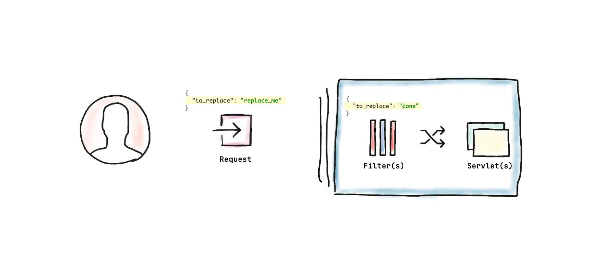

# Replace Filter Demo

A demo project which demonstrates the work of [javax.servlet.Filter](https://javaee.github.io/javaee-spec/javadocs/javax/servlet/Filter.html) 
capable of escaping / modifying / removing a part of JSON request based on specified criteria.

## How it works

1. A request is being dispatched with a matching configured in [ReplaceUtils.kt](TODO)
2. The [ReplaceFilter](TODO) detects it
3. Already mentioned [ReplaceUtils.kt](TODO) picks up and applies a replace function for the matched string
4. The resulted JSON with replaced string gets processed further down (other HTTP filters, servlets, etc.)

